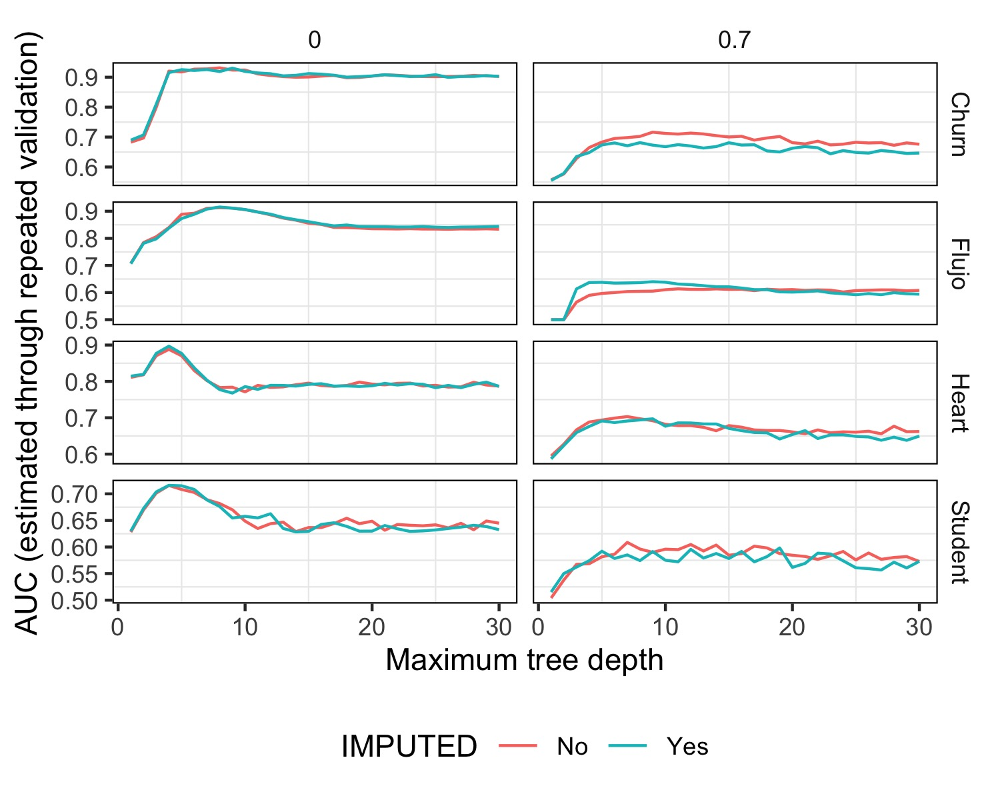

```{r, include=FALSE, warning=FALSE, message=FALSE}
# source ("sample_exp.R")
```

## Introducción

A partir de los dos datasets incluidos con la consigna (Churn y Hearts) y dos datasets que obtuvimos a partir de nuestra investigación (flujo de autos y performance de estudiantes) realizamos un análisis exploratorio de los datos, y evaluamos la performance de distintos modelos de arboles de decisión para predecir la variable objetivo de cada dataset.

El objetivo de este trabajo es poder observar el comportamiento de los modelos de arboles de decisión en distintos datasets, y ver como se ve afectada la performance de los mismos al hacer distintos preprocessamientos de los datos, asi como la performance de los arboles para distintas profundidades.

## Datasets

### Churn

El dataset Churn contiene información sobre clientes de una compañía de telecomunicaciones de Irán. Cada fila representa un cliente y cada columna una variable. Las variables son:

    call_failure, complains, subscription_length, charge_amount, seconds_of_use, frequency_of_use,
    frequency_of_sms, distinct_called_numbers, age_group, tariff_plan, status, age, customer_value

(10 atributos numéricos y 3 categoricos)

La columna a predecir es la variable `churn` que indica si el cliente se dio de baja o no.

Link: https://archive.ics.uci.edu/dataset/563/iranian+churn+dataset

### Hearts

El dataset Hearts contiene información sobre pacientes y su condición respecto a Enfermedad del Corazón.

Las variables del dataset son:

    Age, Sex, ChestPainType, RestingBP, Cholesterol, FastingBS, RestingECG 
    MaxHR, ExerciseAngina, Oldpeak, ST_Slope, HeartDisease

(5 atributos binarios y 6 numéricos)

La columna a predecir es la variable `HeartDisease` que indica si el paciente tiene o no Enfermedad del Corazón.

Link: https://archive.ics.uci.edu/ml/datasets/Heart+Disease


\newpage

### Flujo de autos

El dataset Flujo de autos contiene información sobre cantidad de autos al ingreso o egreso de la ciudad de Buenos Aires.

El dataset originalmente contenía las columnas:

| Nombre | Tipo | Descripción |
| --- | --- | --- |
| CODIGO_LOCACION | string | codigo de locacion |
| lat | string | latitud de la ubicación del sensor |
| long | string | longitud de la ubicación del sensor |
| fecha y hora | date | fecha del registro |
| sentido | string | sentido de la ubicación del sensor |
| cantidad | integer | cantidad de autos que detectó el sensor en esa franja horaria |

Para convertirlo en un problema de predicción binaria, se agregó una columna `greater_mean` la cual contiene `True` si la cantidad de autos es mayor al promedio de autos de ese sentido y hora, y `False` en caso contrario.

Ademas para facilitar el análisis exploratorio, se agregaron las columnas `anio`, `mes`, `dia` y `hr` que contienen el año, mes, dia y hora respectivamente. Los minutos y segundos siempre eran 0, por lo que no se incluyeron. Por último se eliminó la columna `CODIGO_LOCACION` ya que no aportaba información relevante.

El dataset resultante contiene las columnas:

    SENTIDO,LATITUD,LONGITUD,anio,mes,dia,hr,greater_mean

(1 atributo binario y 6 numéricos)

La columna a predecir es la variable `greater_mean` que indica si la cantidad de autos es mayor al promedio de autos de ese sentido y hora.

Al calcular la media de cantidad de autos, nos encontramos con el problema de cometer **Data Leakage**, ya que estabamos promediando la columna cantidad sin separar previamente en datos de Train y de Validación. 

Para solucionar este problem se podrían separar los datos en Train y Validación, y luego calcular la media de cantidad de autos de cada sentido y hora en el conjunto de Train. Por como está planteado el código esto no fue posible, por lo que solo usamos este dataset para observar su comportamiento en el experimento de ejemplo pero no en el resto de los experimentos.

Como el dataset contenía 189.815 filas, decidimos tomar una muestra aleatoria de 10.000 filas para poder trabajar con el mismo.

Este dataset fue obtenido de la página de datos abiertos del Gobierno de la Ciudad de Buenos Aires.

Link: https://data.buenosaires.gob.ar/dataset/flujo-vehicular-anillo-digital/resource/1df1e3f1-ab85-47b5-becc-39054d6761ee

\newpage

### Performance de estudiantes

Este dataset contiene información sobre muchos estudiantes en dos escuelas secundarias de Portugal, y su performance en dos materias: Matemática y Portugués. Para llevar a cabo el experimento, nos quedamos con el dataset de Portugal ya que contiene más datos que el de Matemática (649 vs 395). Los atributos son los siguientes 30:

| Nombre | Tipo | Descripción |
| --- | --- | --- |
| school | binario | escuela del estudiante |
| sex | binario | sexo del alumno |
| age | numérico | edad del estudiante |
| address | binario | tipo de domicilio del estudiante |
| famsize | binario | tamaño de la familia |
| Pstatus | binario | estado de convivencia de los padres |
| Medu | numérico | educación de la madre |
| Fedu | numérico | educación del padre |
| Mjob | categorico | trabajo de la madre |
| Fjob | categorico | trabajo del padre |
| reason | categorico | razón para elegir este centro |
| guardian | categorico | tutor del alumno |
| traveltime | numérico | tiempo de viaje de casa al colegio |
| studytime | numérico | tiempo de estudio semanal |
| failures | numérico | número de fracasos de clase anteriores |
| schoolsup | binario | apoyo educativo adicional |
| famsup | binario | apoyo educativo familiar |
| paid | binario | clases pagadas extra dentro de la asignatura del curso |
| activities | binario | actividades extraescolares |
| nursery | binario | asistió a la guardería |
| higher | binario | desea cursar estudios superiores |
| internet | binario | acceso a internet en casa |
| romantic | binario | con una relación romántica |
| famrel | numérico | calidad de las relaciones familiares |
| freetime | numérico | tiempo libre después de la escuela |
| goout | numérico | salir con amigos |
| Dalc | numérico | consumo de alcohol en días laborables |
| Walc | numérico | consumo de alcohol en fin de semana |
| health | numérico | estado de salud actual |
| absences | numérico | número de faltas de asistencia a la escuela |

(13 binarias, 4 nominales contra 13 numericas)

El dataset tambien contiene las siguientes 3 variables de notas: 

- 31 G1 - nota del primer trimestre (numérico: de 0 a 20)
- 31 G2 - nota del segundo trimestre (numérico: de 0 a 20)
- 32 G3 - nota del tercer trimestre (numérico: de 0 a 20)

Para convertirlo en un problema de decisión binaria, agregamos de la columna "pass" que contiene "True" si el promedio de las notas G1, G2 y G3 es mayor a 12, y "False" en caso contrario.

Luego de ya haber corrido todos los experimentos, encontramos que la nota de aprobación era 10/20. Como el último experimento tomo un tiempo considerable, decidimos no volver a correrlo con la nueva nota de aprobación. Es muy posible que las notas G1/G2/G3 estén puestas en función a si el alumno esta en condición de aprobar y no en función a su performance en los trimestres per-se, por lo que de volver a realizar el experimento tendríamos en cuenta este "valor de corte".

Link: https://archive.ics.uci.edu/dataset/320/student+performance


## Experimento de ejemplo

El experimento de ejemplo, busca ver la performance de los distintos modelos de arboles de decisión para predecir una variable de salida de cada dataset. Ademas, por cada dataset se plantean dos experimentos: uno con el dataset original y otro con el dataset preprocesado.

En el preprocesamiento, se eliminan datos con una proporción `prop_NA` a cada atributo del dataset.

## Resultados



En la figura 1 se puede observar la performance de los distintos modelos de arboles de decisión con la métrica AUC (Area Under the Curve) para cada dataset y cada experimento.

Se puede observar como para los 4 datasets, el modelo con `prop_NA = 0` muestra alcanzar un pico de performance inicialmente, y luego ir decayendo a medida que se aumenta la profundidad del árbol. Aproximadamente esto comienza a ocurrir para todos los datasets cuando el `max_tree_depth >= 15`. Esto se debe a que el modelo se vuelve muy flexible y se va sobreajustando a los datos de entrenamiento, y por lo tanto no generaliza bien a los datos de validación. 

Cabe destacar que para el dataset Churn, la caida es muy leve, manteniendose casi constante a medida que aumenta la profundidad del árbol. Por el otro lado, para el dataset Heart, se alcanza un valor de AUC casi igual a 1 pero luego al aumentar poco el tamaño del arbol este cae abruptamente.

Sin embargo, para los 4 datasets, el modelo con `prop_NA = 0.7` muestra una performance casi constante a medida que aumenta la profundidad del árbol. Esto se debe a que al eliminar la mas de la mitad de los datos, el modelo no tiene suficiente información para aprender, por lo que no se sobreajusta a los datos de entrenamiento y generaliza mejor a los datos de validación.

En el dataset de Student Performance, se ve mayor variabilidad en el corto plazo con el incremento de la profundidad del árbol. Esto se debe a que el dataset contiene muchos datos, por lo que el modelo puede aprender mejor y por lo tanto sobreajustarse a los datos de entrenamiento.
