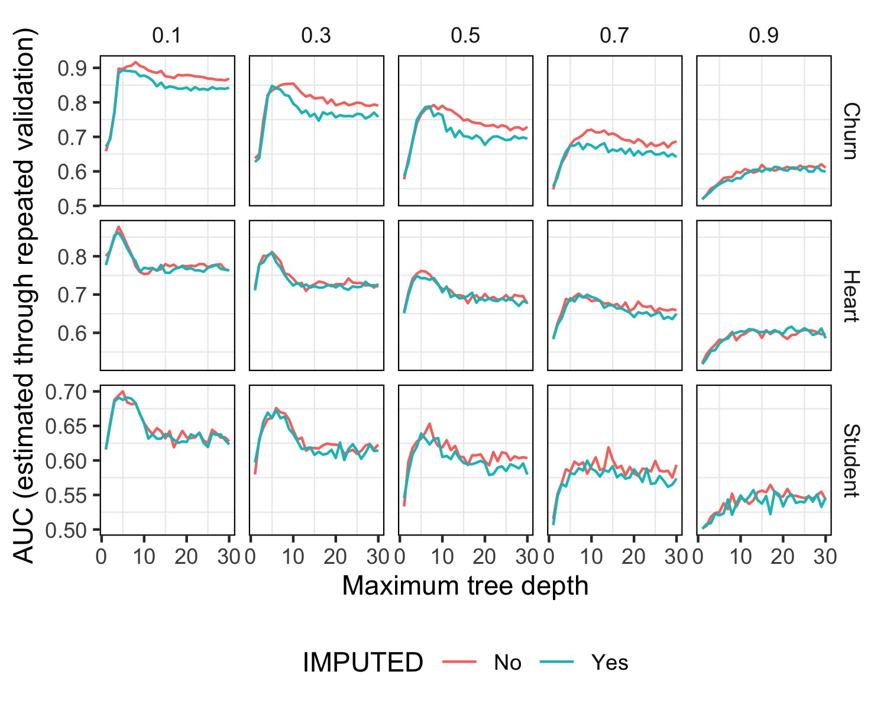

```{r, include=FALSE, echo=FALSE}
# source ("exp_1.R")
```

## Introducción y Metodología

Para este experimento, se replicó lo llevado a cabo en el experimento de ejemplo, pero además de modificar los datasets con valores faltantes en proporción 0 y 0,7, se realizó tambien con las proporciones 0,1; 0,3; 0,5; 0,7 y 0,9.

Para llevarlo a cabo, se partió del script en `sample_exp.R` y se modifico el intervalo de la siguiente manera: `for (prop_NAs in c(0, 0.7))` $=>$ `for (prop_NAs in seq(0.1, 0.9, 0.2))`.

Por lo observado en el experimento de ejemplo, se esperaba que a medida que aumentara la proporción de valores faltantes, la métrica `AUC` disminuyera.

En este experimento ya no se utilizó el Dataset de "Flujo Vehicular" pero si los de "Iranian Churn", "Heart Disease" y "Student Performance".

## Resultados



Como era de esperarse, a medida que aumenta la proporción de valores faltantes, la métrica `AUC` disminuye. Sin embargo, se observa que la disminución no es lineal, sino que a partir de la proporción 0,5, la disminución es más pronunciada. 

Ademas, se puede ver como para los valores de `prop_NA` $<= 0.5$ existe un "pico" en la métrica `AUC` para los arboles cuya profundidad esta alrededor de 5. Esto puede deberse a que para valores de `prop_NA` $<= 0.5$ la cantidad de valores faltantes es baja, por lo que el árbol no se ve afectado en gran medida. Más aún, para el valor de `prop_NA` $= 0.9$, la métrica `AUC` se ve creciente a medida que aumenta la profundidad del árbol. Esto puede deberse a que para valores de `prop_NA` $= 0.9$ la cantidad de valores faltantes tan alta que el árbol no puede predecir correctamente, por lo que a mayor profundidad, el árbol se ajusta mejor a los datos.

## Conclusiones

La intuición inicial sobre la relación entre la proporción de valores faltantes y la métrica `AUC` parece haberse cumplido. Es interesante ver como el modelo parece requerir de mayor profundidad para mejorar sus preducciónes a medida que hay mas datos faltantes.
