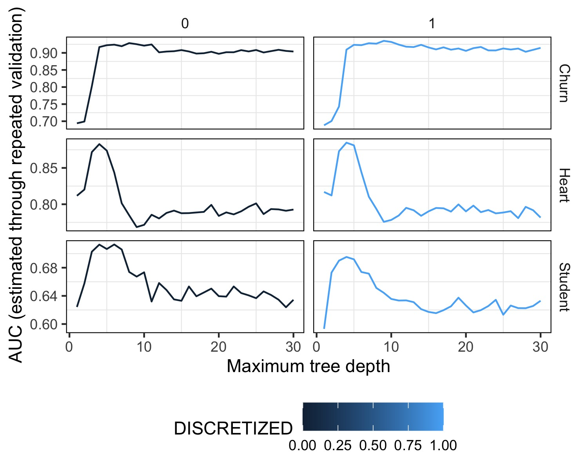

source ("exp_3.R")

```{r echo=FALSE, message=FALSE, warning=FALSE}

set.seed(364630336)

# Leer tabla en "outputs/tables/exp3.txt"
library(ggplot2) # For creating plots
library(dplyr) # For data manipulation
library(knitr)
library(tidyr)

filename_exp_results <- "outputs/tables/exp3.txt"

exp_results <- read.table(filename_exp_results, header=TRUE, sep="\t")

# Rename exp_results prop_NAs column to ohe
exp_results <- exp_results %>%
  rename(ohe = prop_NAs)

# Replace 0 with FALSE and 1 with TRUE
exp_results$ohe <- ifelse(exp_results$ohe == 0, FALSE, TRUE)

churn <- exp_results %>%
  filter(dataset_name == "Churn")

heart <- exp_results %>%
  filter(dataset_name == "Heart")

student <- exp_results %>%
  filter(dataset_name == "Student")

churn_ohe <- churn %>%
  group_by(maxdepth, IMPUTED, ohe) %>%
  summarize(mean_auc = mean(auc), .groups = "drop")

heart_ohe <- heart %>%
    group_by(maxdepth, IMPUTED, ohe) %>%
    summarize(mean_auc = mean(auc), .groups = "drop")

student_ohe <- student %>%
    group_by(maxdepth, IMPUTED, ohe) %>%
    summarize(mean_auc = mean(auc), .groups = "drop")

```

## Introducción

Para desarrollar este experimento se planteo testear el comportamiento del modelo al aplicar *One-Hot Enconding* a las variables de los datasets. 

## Resultados



En la figura no se logran observar diferencias significativas entre los resultados obtenidos con y sin *One-Hot Enconding*, por lo que generamos 3 figuras nuevas una por cada dataset para poder observar mejor los resultados.

### Churn

Para el dataset de Iranian Churn se observa que el mayor valor de AUC para el dataset sin *One-Hot Enconding* se obtiene con un árbol de `maxdepth=7` cuando no se imputan los valores faltantes y con un árbol de `maxdepth=5` cuando si se imputan los valores faltantes con la media. 

En cambio, para el dataset con *One-Hot Enconding* se obtiene el mayor valor de AUC con un árbol de `maxdepth=6` cuando no se imputan los valores faltantes y con un árbol de `maxdepth=5` cuando se imputan los valores faltantes con la media.


```{r echo=FALSE, message=FALSE, warning=FALSE}
# Get tree depth with max AUC for each imputation method

churn_maxs <- churn_ohe %>%
  group_by(IMPUTED, ohe) %>%
  filter(mean_auc == max(mean_auc)) %>%
  select(maxdepth, IMPUTED, mean_auc, ohe)

# Replace TRUE/FALSE w Yes/No in ohe column
churn_maxs$ohe <- ifelse(churn_maxs$ohe == TRUE, "Yes", "No")

kable(churn_maxs, caption = "Churn Max AUCs")
```

```{r echo=FALSE, message=FALSE, warning=FALSE}
ggplot(churn_ohe, aes(x = maxdepth, y = mean_auc, color = IMPUTED)) +
  geom_line() +
  geom_point() +
  facet_wrap(~ohe) +
  labs(title = "Churn",
       x = "Max Depth",
       y = "Mean AUC",
       color = "Imputed") +
  theme_minimal()
```

```{r echo=FALSE, message=FALSE, warning=FALSE}
ggplot(heart_ohe, aes(x = maxdepth, y = mean_auc, color = IMPUTED)) +
  geom_line() +
  geom_point() +
  facet_wrap(~ohe) +
  labs(title = "Heart",
       x = "Max Depth",
       y = "Mean AUC",
       color = "Imputed") +
  theme_minimal()

```

```{r echo=FALSE, message=FALSE, warning=FALSE}
ggplot(student_ohe, aes(x = maxdepth, y = mean_auc, color = IMPUTED)) +
  geom_line() +
  geom_point() +
  facet_wrap(~ohe) +
  labs(title = "Student",
       x = "Max Depth",
       y = "Mean AUC",
       color = "Imputed") +
  theme_minimal()
```
