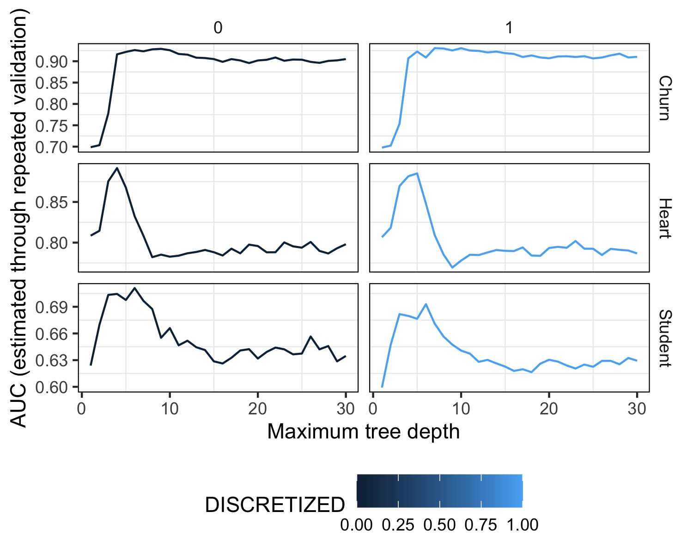

```{r echo=FALSE, message=FALSE, warning=FALSE}

# source("exp_3.R")

set.seed(364630336)

# Leer tabla en "outputs/tables/exp3.txt"
library(ggplot2) # For creating plots
library(dplyr) # For data manipulation
library(knitr) # For kable

filename_exp_results <- "outputs/tables/exp3.txt"

exp_results <- read.table(filename_exp_results, header=TRUE, sep="\t")

# Replace 0 with FALSE and 1 with TRUE
exp_results$DISCRETIZED <- ifelse(exp_results$DISCRETIZED == 0, FALSE, TRUE)

churn <- exp_results %>%
  filter(dataset_name == "Churn")

heart <- exp_results %>%
  filter(dataset_name == "Heart")

student <- exp_results %>%
  filter(dataset_name == "Student")

churn_disc <- churn %>%
  group_by(maxdepth, DISCRETIZED) %>%
  summarize(mean_auc = mean(auc), .groups = "drop")

heart_disc <- heart %>%
    group_by(maxdepth, DISCRETIZED) %>%
    summarize(mean_auc = mean(auc), .groups = "drop")

student_disc <- student %>%
    group_by(maxdepth, DISCRETIZED) %>%
    summarize(mean_auc = mean(auc), .groups = "drop")

```

## Introducción

Para desarrollar este experimento estudiaremos como, para cada uno de los tres datasets analizados, cómo impacta tratar las variables categóricas ordinales con OHE estándar, versus convertirlas en un número que refleje el orden de las categorías (algo que se logra con discretize igual a TRUE, n_bins igual a 10 y ord_to_numeric igual a TRUE en preprocess_control).

## Resultados

A simple vista, los datasets de _Churn_ y _Heart_ no parecen verse afectados por la discretización de las variables categóricas, mientras que el dataset de _Student_ parece verse afectado negativamente. Sin embargo, para poder analizarlo mejor, vamos a graficar la performance de los modelos para cada dataset en función de la profundidad máxima del árbol.




\newpage

### Churn

Como se puede observar en la "_Tabla 1_", para el dataset de *Iranian Churn*, el mayor valor de ROC AUC se obtiene al procesar las variables categoricas convirtiendo sus valores en números que reflejen el orden de las categorías. Ademas, para el mayor valor de AUC alcanzado por el dataset sin procesar, se requirió de una mayor profundidad del árbol (`max_depth=9`) que para el dataset procesado (`max_depth=7`). Esto se puede observar en la "_Figura Churn_" donde se grafica la performance de los modelos en función de la profundidad máxima del árbol.


```{r echo=FALSE, message=FALSE, warning=FALSE}
# Get tree depth with max AUC for each imputation method

churn_maxs <- churn_disc %>%
  group_by(DISCRETIZED) %>%
  filter(mean_auc == max(mean_auc)) %>%
  select(maxdepth, mean_auc, DISCRETIZED)

churn_maxs <- churn_maxs %>%
    arrange(DISCRETIZED)

# Replace TRUE/FALSE w Yes/No in ohe column
churn_maxs$DISCRETIZED <- ifelse(churn_maxs$DISCRETIZED == TRUE, "Yes", "No")

kable(churn_maxs, caption = "Churn Max AUCs")
```

```{r echo=FALSE, message=FALSE, warning=FALSE}
ggplot(churn_disc, aes(x = maxdepth, y = mean_auc)) +
  geom_line() +
  geom_point() +
  facet_wrap(~DISCRETIZED) +
  labs(title = "Churn",
       x = "Max Depth",
       y = "Mean AUC") +
  theme_minimal()
```

Por último, en la cola derecha de los gráficos, parece observarse que el modelo entrenado con el dataset procesado mantiene una performance más estable a medida que aumenta la profundidad del árbol.

\newpage

### Heart

```{r echo=FALSE, message=FALSE, warning=FALSE}
# Get tree depth with max AUC for each imputation method

heart_maxs <- heart_disc %>%
  group_by(DISCRETIZED) %>%
  filter(mean_auc == max(mean_auc)) %>%
  select(maxdepth, mean_auc, DISCRETIZED)

# Sort by ohe

heart_maxs <- heart_maxs %>%
  arrange(DISCRETIZED)

```

En este caso, en el gráfico inicial observamos que el dataset de *Heart Disease* parece obtener peores resultados al procesarlo. Para confirmar esto generamos la siguientes tablas (Table 2 y Table 3) donde podemos observar el valor máximo y mínimo de AUC para cada uno de los datasets.

Tanto para el valor maximo alcanzado como para el valor minimo, el dataset sin procesar obtiene mejores resultados y con profundidades de arboles menores.


```{r echo=FALSE, message=FALSE, warning=FALSE}

# Replace TRUE/FALSE w Yes/No in ohe column
heart_maxs$DISCRETIZED <- ifelse(heart_maxs$DISCRETIZED == TRUE, "Yes", "No")

kable(heart_maxs, caption = "Heart Max AUCs")

# Min values

heart_mins <- heart_disc %>%
  group_by(DISCRETIZED) %>%
  filter(mean_auc == min(mean_auc)) %>%
  select(maxdepth, mean_auc, DISCRETIZED)

# Sort by ohe

heart_mins <- heart_mins %>%
  arrange(DISCRETIZED)

# Replace TRUE/FALSE w Yes/No in ohe column
heart_mins$DISCRETIZED <- ifelse(heart_mins$DISCRETIZED == TRUE, "Yes", "No")

kable(heart_mins, caption = "Heart Min AUCs")
```


\newpage

```{r echo=FALSE, message=FALSE, warning=FALSE}
ggplot(heart_disc, aes(x = maxdepth, y = mean_auc)) +
  geom_line() +
  geom_point() +
  facet_wrap(~DISCRETIZED) +
  labs(title = "Heart",
       x = "Max Depth",
       y = "Mean AUC",
       color = "Imputed") +
  theme_minimal()

```

\newpage

### Student

```{r echo=FALSE, message=FALSE, warning=FALSE}
# Get tree depth with max AUC for each imputation method

student_maxs <- student_disc %>%
  group_by(DISCRETIZED) %>%
  filter(mean_auc == max(mean_auc)) %>%
  select(maxdepth, mean_auc, DISCRETIZED)

# Sort by ohe

student_maxs <- student_maxs %>%
  arrange(DISCRETIZED)

```

Al igual que en el caso de *Heart Disease*, el dataset de *Student Performance* parece obtener peores resultados al procesarlo. Nuevamente generamos las siguientes tablas donde podemos observar el valor máximo y mínimo de AUC para cada uno de los datasets.

```{r echo=FALSE, message=FALSE, warning=FALSE}

# Replace TRUE/FALSE w Yes/No in ohe column
student_maxs$DISCRETIZED <- ifelse(student_maxs$DISCRETIZED == TRUE, "Yes", "No")

kable(student_maxs, caption = "Student Max AUCs")

# Min values

student_mins <- student_disc %>%
  group_by(DISCRETIZED) %>%
  filter(mean_auc == min(mean_auc)) %>%
  select(maxdepth, mean_auc, DISCRETIZED)

# Sort by ohe

student_mins <- student_mins %>%
  arrange(DISCRETIZED)

# Replace TRUE/FALSE w Yes/No in ohe column
student_mins$DISCRETIZED <- ifelse(student_mins$DISCRETIZED == TRUE, "Yes", "No")

kable(student_mins, caption = "Student Min AUCs")
```

A diferencia del dataset _Heart Disease_, tanto a los valores máximos como minimos con el dataset de _Student Performance_ con y sin procesar, se alcanzan con las mismas profundidades de arboles (`max_depth=6` a los máximos y `max_depth=1` a los mínimos). 

Al igual que en el caso de _Heart Disease_, el dataset sin procesar alcanza un valor máximo mayor.

```{r echo=FALSE, message=FALSE, warning=FALSE}
ggplot(student_disc, aes(x = maxdepth, y = mean_auc)) +
  geom_line() +
  geom_point() +
  facet_wrap(~DISCRETIZED) +
  labs(title = "Student",
       x = "Max Depth",
       y = "Mean AUC",
       color = "Imputed") +
  theme_minimal()
```

## Conclusiones    

Aunque no parecería haber un patrón discernible entre los comportamientos de los modelos con y sin la discretización y la conversión de variables ordinales a numericas entre los distintos datasets, los resultados que obtuvimos fueron mayormente negativos.

Nuestra interpretación esta basada en que estos resultados se encuentran dados por la proporción de variables categóricas contra las variables numéricas de cada dataset. En aquel dataset cuya proporción era necesariamente mayor (Heart 5/11), el modelo se veía perjudicado por el procesamiento y en aquellos cuya proporción era menor (Churn 3/13), el modelo se veía beneficiado, aunque mínimo, por el mismo. Para el caso de Student que contiene 13 variables numericas de 30 totales, el procesamiento afecta tambien negativamente al modelo.
